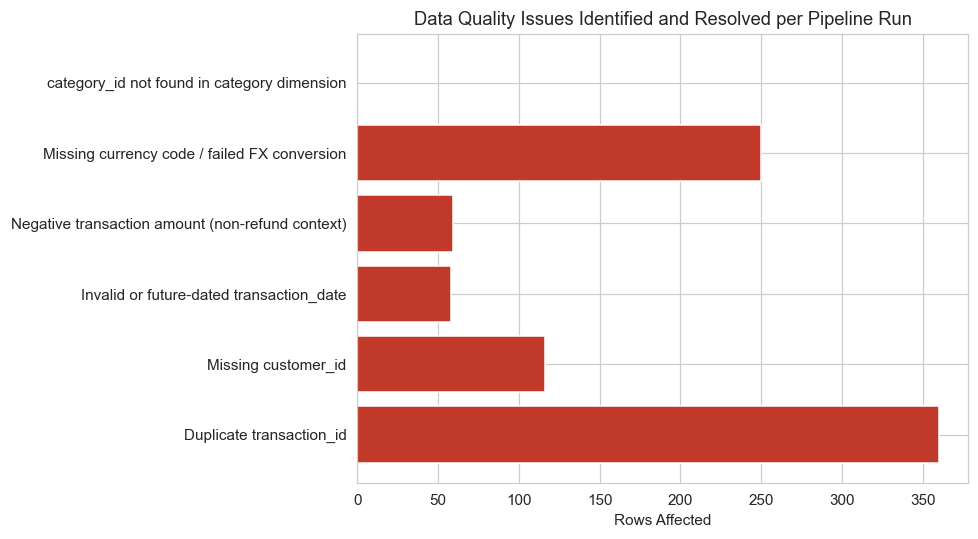
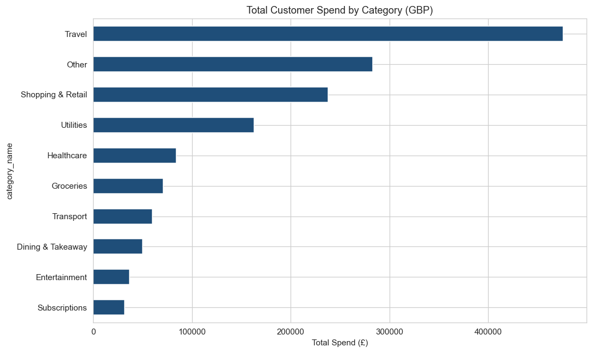
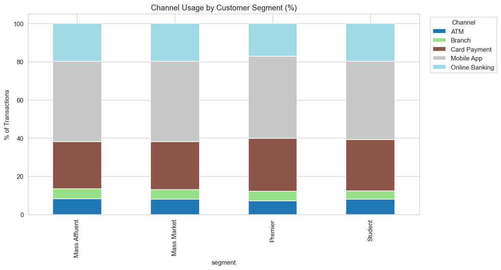
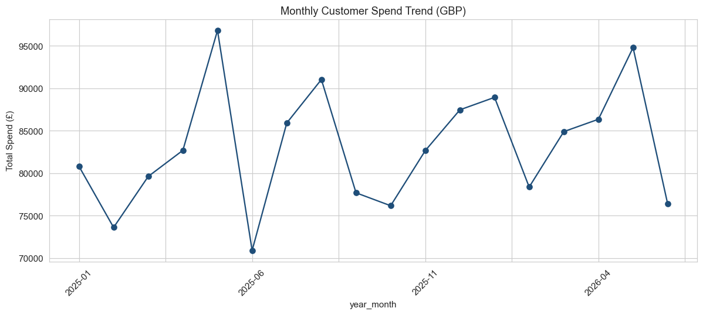

# Retail Banking Transaction Analytics Platform

**Author:** [Your Name] | [LinkedIn](#) | [Email](#)

A end-to-end data & analytics project simulating the work of a **Data & Analytics Analyst** in a retail banking environment: capturing business requirements, building a Snowflake data model, integrating a live API, enforcing data quality, and delivering self-service analytical outputs to business stakeholders.

> **Why this project:** built specifically to demonstrate the skills in a Data & Analytics Analyst (Associate) job description — business requirement documentation, Snowflake (warehouses/stages/data sharing), Python (Pandas/NumPy/Requests), Agile delivery, API integration, and data quality assurance.

## Business Problem

The Customer Insights team receives transaction data from multiple channels (branch, mobile, online, ATM) in inconsistent formats, with no standardised currency conversion, no automated quality checks, and no single trusted view of customer spend. This project builds that single trusted view — from raw extract to a query-ready Snowflake model with documented, traceable outputs.

## Project Structure

```
banking_analytics_project/
├── business_requirements/
│   ├── BRD.md                        # Business Requirements Document
│   ├── user_stories_backlog.md       # Agile epics, stories, sprints
│   ├── traceability_matrix.csv       # Requirement → source → output mapping
│   └── data_dictionary.md            # Self-service reference for stakeholders
├── python/
│   ├── generate_synthetic_data.py    # Synthetic banking data generator
│   ├── api_integration.py            # Live FX rate API (Requests library)
│   ├── etl_pipeline.py               # Pandas/NumPy transformation pipeline
│   ├── data_quality_checks.py        # QA framework + issue logging
│   └── create_visuals.py             # Stakeholder-facing charts
├── snowflake/
│   ├── 01_data_model.sql             # Star schema, warehouse, stage setup
│   ├── 02_load_and_stage.sql         # COPY INTO, reconciliation checks
│   ├── 03_analysis_queries.sql       # Business-question views & queries
│   └── 04_data_sharing_example.sql   # Secure View + role-based sharing pattern
├── data/                             # Generated data + logs (see below)
├── images/                           # Charts referenced in this README
└── EXECUTIVE_SUMMARY.md              # 1-page stakeholder summary
```

## How This Maps to the Job Description

| JD Requirement | Where it's demonstrated |
|---|---|
| Capture, validate, document business/data requirements | `business_requirements/BRD.md`, `traceability_matrix.csv` |
| Snowflake: data modelling, querying, warehouses, stages, data sharing | `snowflake/01_data_model.sql` – `04_data_sharing_example.sql` |
| Python: Pandas, NumPy, Requests | `python/etl_pipeline.py`, `python/api_integration.py` |
| API knowledge / data integration | `python/api_integration.py` — live FX rate API with retry logic |
| Agile working | `business_requirements/user_stories_backlog.md` — epics, stories, sprints |
| Data quality assurance | `python/data_quality_checks.py`, `data/data_quality_log.csv` |
| Interrogate/interpret/visualise data | `snowflake/03_analysis_queries.sql`, `python/create_visuals.py` |
| Traceability of requirements to outputs | `business_requirements/traceability_matrix.csv` |

## Approach

1. **Captured business requirements** as a formal BRD, broken into an Agile backlog across 3 sprints (see `user_stories_backlog.md`).
2. **Generated realistic transaction data** (500 customers, ~12,000 transactions across 10 categories and 5 channels) with intentionally injected data quality issues — duplicates, broken foreign keys, invalid dates, bad amounts — to mirror what a real core-banking extract looks like.
3. **Integrated a live FX rate API** (`requests` library, with retry/backoff and a documented fallback) to standardise multi-currency transactions to GBP.
4. **Built a data quality framework** that identifies, logs, and excludes bad records with a documented reason for every exclusion — nothing is silently dropped.
5. **Modelled the clean data as a Snowflake star schema** (fact/dimension tables), with a separate RAW schema preserved for audit purposes.
6. **Built self-service SQL views** answering real business questions, plus a **Secure View + role-based sharing pattern** so the Product team can access aggregated insights without exposure to customer PII.
7. **Delivered a 1-page executive summary** translating the technical work into a business recommendation.

## Key Results

| Metric | Value |
|---|---|
| Raw transactions processed | 12,360 |
| Data quality pass rate | 94.9% (628 rows identified, logged, and excluded) |
| Highest spend category | Travel (£479K) |
| Customers modelled | 500, segmented into 4 spend tiers |
| Secure sharing pattern | PII-free aggregated view, role-based least-privilege access |

### Data Quality Issues Identified Per Pipeline Run


### Spend by Category


### Channel Usage by Customer Segment


### Monthly Spend Trend


## How to Reproduce

```bash
pip install -r requirements.txt
cd python
python generate_synthetic_data.py     # creates raw extracts
python etl_pipeline.py                # FX standardisation + transformation
python data_quality_checks.py         # QA framework + logging
python create_visuals.py              # charts

# Then in a Snowflake account (free trial works):
# Run snowflake/01_data_model.sql through 04_data_sharing_example.sql in order
```

**Note on the FX API:** this sandbox environment has restricted outbound network access, so `api_integration.py` automatically falls back to cached rates when the live Frankfurter API is unreachable (visible in the console output when you run it). On your own machine, with normal internet access, it calls the live API directly — the retry/fallback logic is there because production integrations shouldn't assume the API is always up.

## A Note on the Data

This project uses **synthetic data**, generated to realistically mirror a retail banking transaction extract (structure, volume, and the kinds of data quality issues a real core-banking feed produces). No real customer data is used anywhere in this project.

## Resume-Ready Summary

> Built an end-to-end banking transaction analytics platform: authored business requirements and Agile backlog, designed a Snowflake star schema, integrated a live FX rate API in Python (Pandas/NumPy/Requests), built a data quality framework achieving a 94.9% clean-data pass rate on 12,000+ transactions, and delivered secure, role-based self-service views for cross-team stakeholder use.
